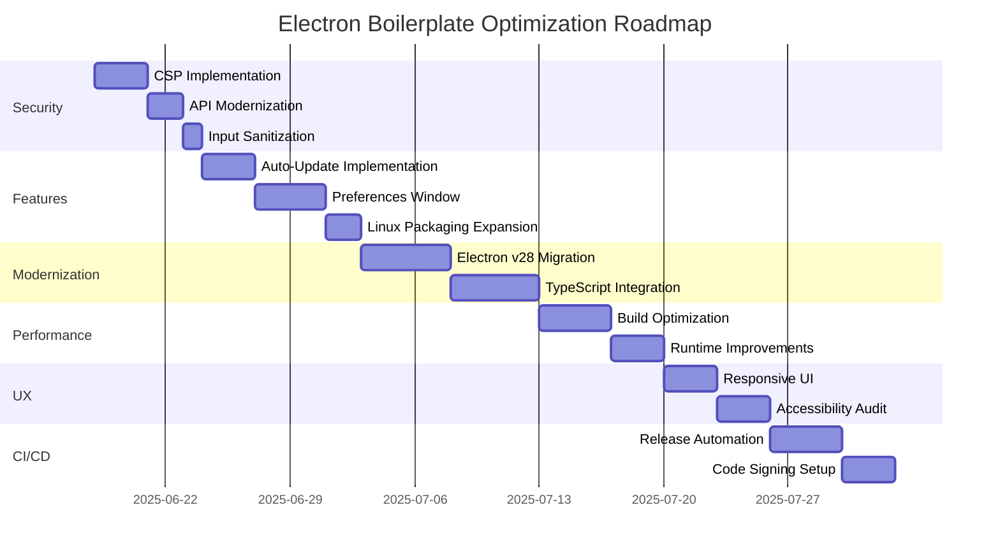

# Electron Boilerplate Optimization Roadmap

## 1. Security Enhancements

- [ ] Implement Content Security Policy (CSP) in `index.html`
- [ ] Replace deprecated Electron APIs:
  - `shell.openItem` → `shell.openPath`
  - `shell.moveItemToTrash` → `shell.trashItem`
- [ ] Enable context isolation and disable nodeIntegration
- [ ] Sanitize user input in `webContents.executeJavaScript` calls
- [ ] Implement certificate pinning for auto-updates

## 2. Feature Completion

- [ ] Implement Preferences window (complete `showPreferences` function)
- [ ] Uncomment and test auto-update logic in `index.js`
- [ ] Add Windows-specific build configurations:
  - Installer options
  - Code signing
- [ ] Extend Linux packaging to include RPM and Snap formats

## 3. Modernization & Maintenance

- [ ] Update Electron from v13 → v28 (latest LTS)
- [ ] Migrate from CommonJS to ES Modules
- [ ] Add TypeScript support:
  - `tsconfig.json` setup
  - Type definitions for main/renderer processes
- [ ] Implement dependency audit workflow
- [ ] Replace placeholder content:
  - Help menu links
  - About menu text
  - App metadata in package.json

## 4. Performance Optimizations

- **Build Performance:**
  - [ ] Implement build caching in CI pipelines
  - [ ] Add parallel build tasks
  - [ ] Configure differential bundling
- **Runtime Performance:**
  - [ ] Implement lazy loading for non-critical modules
  - [ ] Optimize window initialization sequence
  - [ ] Add memory usage monitoring

## 5. User Experience Improvements

- [ ] Make window dimensions responsive (replace fixed 600x400 size)
- [ ] Implement accessible controls:
  - Keyboard navigation support
  - Screen reader compatibility
- [ ] Add error reporting UI with feedback mechanism
- [ ] Implement dark/light theme switching
- [ ] Localization support for menus and UI

## 6. CI/CD Enhancements

- [ ] Add automated release workflow:
  - Version bumping
  - Changelog generation
  - GitHub Releases publishing
- [ ] Implement build matrix for multi-platform testing
- [ ] Add automated update channel testing
- [ ] Configure code signing for all platforms

## 7. Implementation Timeline

**Next Steps:**

1. Review this roadmap for priority adjustments
2. Implement security fixes immediately
3. Schedule modernization work for Q3 2025
4. Assign UX improvements to design team
